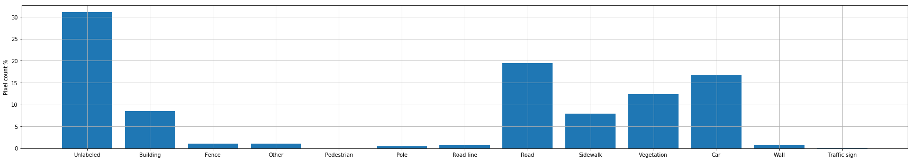
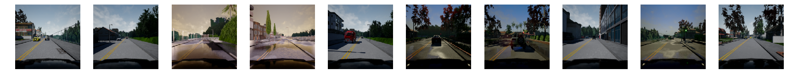
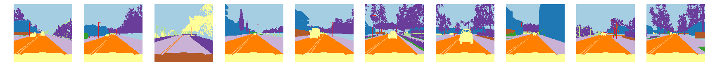
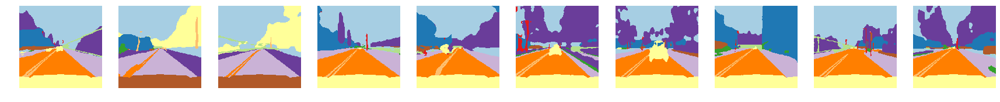

# Autonomous Car Camera Semantic Segmentation

This repository contains the code to train a model for the task of semantic 
segmentation of images obtained from a self driving car. The dataset used to 
train this model is the [Semantic Segmentation for Self Driving Cars](https://www.kaggle.com/kumaresanmanickavelu/lyft-udacity-challenge) from 
Kaggle. 

## Getting started
This project has been tested on Python 3.7.3. And, it will require the 
following libraries:
```
numpy -> numerical computations
pytorch -> deep learning
torchvision -> helper for pytorch for computer vision
pytorch-ignite -> high-level abstraction of pytorch
torchsummary -> model structure visualization
Pillow -> image processing
matplotlib -> visualization 
```
1. Clone the repository
2. Download the data
3. Update the path to the data in `src` --> `run.py`
4. Run the file `run.py` to train and get the results

## Dataset
The dataset used in this project contains series of images from a self 
driving car simulator CARLA. More details about the dataset is available on 
the Kaggle page linked above. The images in the dataset are classified into 
13 different segments:
```text
'Unlabeled', 'Building', 'Fence', 'Other', 'Pedestrian', 'Pole', 'Road line', 'Road', 'Sidewalk', 'Vegetation', 'Car', 'Wall', 'Traffic sign'
```

## Training procedure
A UNet model is used in this project to perform the segmentation task. 
Multiple approaches were taken to create the model. The first iteration of 
the model contained a vanilla UNet architecture with a single change from the
 original description. The upsampling layers were switched with a convolution
  transpose layer. Since the original UNet architecture was used for binary 
  segmentation while the task at hand has multiple classes, adding more 
  learnable parameters should help the model perform better. The model was 
  also designed such that the depth of the UNet could be easily modified. The
   initial depth was set to 5 and the initial number of filters for the 
   starting layer was set to 64. These numbers were not changed much 
   throughout the training process as the model performed well with it. But, 
   they can be modified if needed. All the results are available as releases 
   in this repository including the trained models. The training procedure 
   was done using Kaggle kernels and the kernel which was used to train this 
   model can be found at [Semantic Segmentation](https://www.kaggle.com/aakaashjois/semantic-segmentation). Each version of the kernel 
   contains the different iterations of the model and the results.
   All the models were trained for 30 epochs with a learning 
   rate of 0.001. All the models were trained on the `DataB` in the dataset 
   which is just 1/5th of the entire dataset. The last iteration was finally 
   trained on all entire dataset.
   
   The results from the first model was satisfactory but there was a lot of 
   room for improvement. From the accuracy and loss plots, we can notice the 
   model took a long time to converge, even with an optimizer which has 
   momentum.
   
   Because of these results, the first model was modified. In the second 
   iteration, the all the convolution layers, except the last layer, had a 
   batch normalization performed on it. The batch normalization should help 
   the model converge faster and show a small improvement in the results.
   
   The results of this second model is as expected. In 30 epochs, the model 
   was able to converge much faster and get an accuracy of almost 10% higher.
   From the result from both the first and the second model, we could see 
   that the larger objects were segmented correctly while the smaller ones 
   were not being segmented.
   
   To combat this problem, one of the approach I took was to increase the 
   depth of the model. This was in the hopes that, the model will be able to 
   extract more features for smaller objects in the image and try to segment 
   it. So, the third iteration of the model had a depth of 7. This made no 
   change in the output of the model and the accuracy and loss remained the 
   same. The only change was the size of the model increased from 120 MB to 
   almost 2 GB. So a different approach had to be taken to combat this 
   problem.
   
   When analysing the data, I observed that, there was a huge imbalance in 
   the distribution of the data. It can be seen in the graph below.
   
   
   
   Almost 30% of the pixels are categorized as "Unlabeled" and almost 20% as 
   "Road". It can be clearly seen as to why the model started to detect these
    categories and not identify the rest.
    
   The loss which was used in training all the models was Cross Entropy loss.
    The cross entropy loss tells if each pixel has been predicted the correct
     category. Since there are less number of pixels for the 
     under-represented classes, the loss value will be a lot lower and the 
     during back propogation, the model will get less information about these
      categories. My first approach to tackle this problem was to to provide 
      weights based on the distribution of the categories in the entire 
      dataset. While this method is commonly used to in most of the 
      classification problems, I felt it will not work directly on 
      segmentation. Instead, for each batch of predictions from the model, I 
      calculate the DICE coefficient of the predicted masks for each class 
      with the original mask. And this DICE coefficient is provided as the 
      weights for the Cross Entropy loss.
   
   In the fourth iteration of the model, the depth was changed back to 5 and 
   the loss function as described above was used. This showed a significant 
   improvement in the results. While the accuracy fell by 5%, the predicted 
   masks now had classes which was not being recognized before. We could see 
   classes like road lanes being detected. I felt this was far better 
   approach in the task of segmentation. Especially since it is for a self 
   driving car, the model which is able to detect more objects especially 
   things like poles, fences and road lanes, are important than detecting the
    road with very high accuracy.
    
   Even with the use of the new loss function, I still noticed that, as the 
   backpropogation takes place, the model is still receiving information only
    about the pixels it has wrongly classified even that information is 
    weighed based on the classes. I felt the loss function should also 
    include the information about how the model performed for each class. To 
    provide this kind of information to the model, the loss function was 
    modified again to include Tversky loss. Tversky loss is a generalization 
    of DICE coefficent and will be able to calculate the loss value for how 
    the model performed for each class. So the final loss function included 
    an equal weight of cross entropy loss weighed by dice coefficient and the
     tversky loss.
     
  The fifth iteration of the model was trained using this advanced loss 
  function. Here, we could clearly see improvement. Previously, the model 
  detected the under-represented classes but was classifying the wrong pixels
   for it. In this iteration, the model was able to get the information of 
   the wrong classified pixels as well as the wrongly classified classes and 
   it was able identify these under-represented classes correctly and in the 
   right location. This is clearly a significant improvement in the model 
   performance.
   
  Once the model architecture, the loss function and the training procedure 
  was fixed, the model was finally trained on the entire dataset with 20% 
  being withheld for validation. The final results shows a very clear 
  improvement in the model performance. The accuracy went back up to 90% and 
  all the under-represented classes in the image were being clearly 
  identified and classified. Cars which were closer were no longer just a 
  blob but took a clear shape of a car and even the street lights and poles 
  which were closer to the camera took a clear shape of the object. The road 
  lanes are now classified clearly showing both the stripes.
  
 ## Results
 Original Images:
 
 Original Masks:
 
Predicted Masks:


## Limitations
While the model is showing some good performance, it has many limitations at 
the current state. One of the limitation is from the architecture of the 
model. Using the UNet architecture, the model has too many parameters and is 
not something which can run at real time. For a self driving car, a real time
 segmentation will be needed as the cars are capable of travel at high speeds
  and will need to be able to identify the oncoming objects in real time to 
  make the right decisions. Another limitation of the model is the complexity
   of segmentation. We can see from the results that cars at a distant show 
   up as a blob. This can hinder the decision a self driving car can make if 
   it is not able to clearly identify the objects at a distance.

## Future work
Some of the future work can be to tackle the limitations of the model. Also, 
when the model was trained, the hyper parameters were not tuned. One of the 
areas which can make the model get a better performance is to tune the 
hyper parameters in the loss function.

## License
This license for this project can be found at [LICENSE](./LICENSE.md).

## Author
This project is created by [Aakaash Jois](https://aakaashjois.com). You can 
find more projects on [GitHub](https://github.com/aakaashjois).
